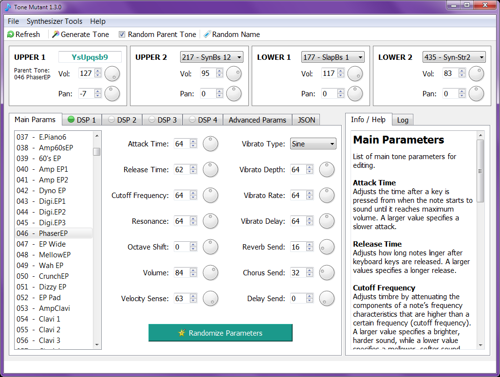

# Tone Mutant
**Tone Mutant** is a tone editing tool designed for Casio CT-X series keyboards.

## Features
* Real-time control of tone parameters: Allows adjustment of parameters, including DSP effects, for the currently selected keyboard tone.
* Tone randomization: Ability to generate a random tone or randomize specific tone parameters.
* Save tone parameters as TON files: Compatible with the keyboard.
* Save and load tone parameters as JSON-formatted files: For CT-X700 and CT-X800 keyboards, which don't have user memory.
* Save tones directly to the synthesizer's internal memory.
* Rename tones stored in the synthesizer's memory: For better organization.
* Delete tones from the synthesizer's memory.
* Displays a log of incoming and outgoing MIDI messages: For monitoring and debugging.
* Option to send custom MIDI messages.



##### Supported synthesizer models:
```
CT-X5000
CT-X3000 (not tested yet)
CT-X8000IN (not tested yet)
CT-X9000IN (not tested yet)
CT-X700 (not tested yet)
CT-X800 (not tested yet)
```

## Installation and Usage
You can download the executable for Windows 7, 10, and 11 from [here](https://github.com/Barsik-Barbosik/Tone-Mutant/releases).

1. Place the application in a writable directory (a configuration file will be created in the same folder).
2. Connect the synthesizer to your PC using a USB cable and turn the synthesizer on.
3. Run **Tone Mutant**.
4. Open the **File** menu and go to **Settings** to configure the MIDI input and output ports.
5. Once set up, try turning the knobs on your synthesizer to control the parameters.

The **Synchronize Tone** button is used to synchronize data from the synthesizer to the computer. It's provided as a backup, because even though the program has auto-sync, it may fail to trigger if instruments are changed too frequently. Additionally, this button can be used to retrieve tone data if the synthesizer was powered on after **Tone Mutant** was already running.

The **Randomize Tone** button sets random main tone parameters and selects two random DSP modules with random parameters.

**Note:** The initial sound wave of a tone cannot be changed on the fly. For example, if you select a guitar sound, random parameters will be applied to that guitar sound. To achieve a piano-like sound, select any tone from the piano section first. When you save the modified tone as a JSON file, the name and number of the initial tone are saved as 'parent_tone'.

## Running the Application with Python
To run the application directly in Python, follow these steps:

### Dependencies
Make sure you have the following dependencies installed:

- **Python 3.8**
- **PySide2 5.15** (Qt for Python)
- **Python-rtmidi 1.4.9** (a Python binding for the RtMidi C++ library)
- **Nuitka 2.5** (for compiling)
```bash
pip install -r requirements.txt
```
I have not tested with other versions.

### Running the Application
1. Clone or download the source code.
2. Navigate to the project directory.
3. Run the application with Python:
```bash
python main.py
```
4. The application should now be running, and you can proceed with the setup as described in the Installation and Usage section.

### Building the Application with Nuitka
Navigate to the project directory and use Nuitka to compile the Python script. All required Nuitka project options are embedded in the `main.py` file.
```bash
python -m nuitka main.py
```

## Acknowledgments
I would like to thank GitHub user **michgz** for his project ["Tone Tyrant for Casio"](https://github.com/michgz/tonetyrant).
Initially, I only aimed to make the interface of his program a bit more user-friendly, but it eventually grew into a separate project. Additionally, a lot of information about various [MIDI parameters](https://github.com/michgz/ac7maker/tree/master/Documentation%20of%20Casio%20formats) in Casio synthesizers was obtained from the projects in his repository.

And thanks to the users of the www.casiomusicforums.com community. Some useful information was found there, such as the names of amplifiers and pedals used in the DSP effects.

## License
This project is licensed under the LGPLv3 License - see the [LICENSE.md](LICENSE.md) file for details.

This project includes some code adapted from Tone Tyrant for Casio, which is licensed under the [MIT License](https://github.com/michgz/tonetyrant/blob/master/LICENSE).

This software uses PySide2, which is licensed under the LGPLv3 and GPLv2 licenses. For details, see [PySide2 Licensing](https://wiki.qt.io/Qt_for_Python_Licensing). The underlying Qt framework, utilized via PySide2, is licensed under the LGPLv3, GPLv3, and commercial licenses. For more information, visit the [Qt Licensing page](https://www.qt.io/licensing/).

This software uses Python-RtMidi, which is distributed under the [MIT License](https://github.com/SpotlightKid/python-rtmidi/blob/master/LICENSE.md). RtMidi is distributed under a [modified MIT License](https://github.com/SpotlightKid/python-rtmidi/blob/master/LICENSE.md).

This software may be compiled using Nuitka, an optimizing Python compiler. Nuitka is distributed under the Apache License 2.0. For details, see the [Nuitka License page](https://nuitka.net/pages/license.html).

Button icons used in this software are licensed under a [Creative Commons Attribution 3.0 License](https://creativecommons.org/licenses/by/3.0/). Fugue Icons and Diagona Icons are property of [Yusuke Kamiyamane](https://p.yusukekamiyamane.com/). Some other icons are the property of [Aha-Soft](http://www.aha-soft.com/free-icons/).

**Company and product names used in this software may be registered trademarks of others.**
